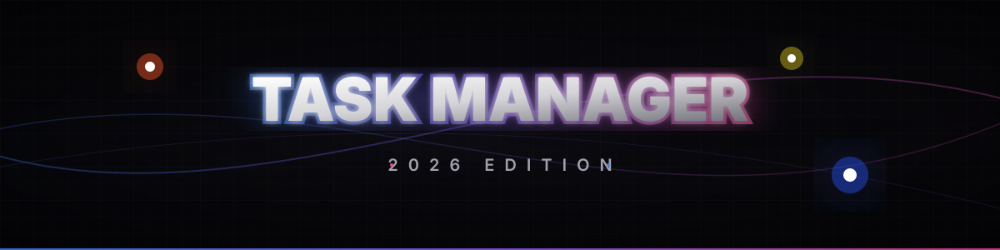

  

  
   
  
  

    <strong>A hyper-modern, zero-dependency DOM Explorer & Task Manager built for the bleeding-edge web.</strong>
  

  

    <a href="#-overview">Overview</a> •
    <a href="#-premium-features">Features</a> •
    <a href="#-tech-stack--2026-standards">Tech Stack</a> •
    <a href="#-architecture--code-quality">Architecture</a>
  

---

##  Overview

The **Interactive Task Manager 2026** is not just a standard to-do list—it is an academic-grade masterclass in modern DOM manipulation. Built entirely without frameworks, it leverages the absolute latest web standards (up to August 2026) to deliver a buttery-smooth, premium user experience. 

It features native physics-based spring animations, 3D interactive toggles, and a Declarative Shadow DOM playground for tracing event propagation.

---

##  Premium Features

-  **Liquid 3D UI/UX:** Features a custom-built 3D Day/Night toggle switch utilizing complex SVG math, radial gradients, and shrinking glow effects.
-  **Physics-Based Spring Animations:** UI elements interact using `linear()` and `cubic-bezier()` spring physics for snappy, satisfying feedback.
-  **Native Scroll-Driven Animations:** Task cards smoothly fade in as they scroll into view using CSS `animation-timeline`, requiring absolute zero JavaScript.
-  **Event Trace Playground:** An isolated web component (Declarative Shadow DOM) allowing developers to visually trace the exact flow of Event Capturing and Bubbling across the DOM tree.
-  **Rendering Pipeline Visualizer:** A beautiful CSS grid topology illustrating the browser's internal engine flow from HTML Parsing to the Render Tree.

---

##  Tech Stack & 2026 Standards

This project abandons legacy approaches in favor of the strict 2026 web platform.

| Technology | 2026 Standard Implementation |
| :--- | :--- |
| **HTML** | Uses `<template shadowrootmode="open">` (Declarative Shadow DOM) and native `<dialog>` overlays. |
| **CSS** | Fully refactored with **Native CSS Nesting** (`&`), customized dropdowns via `appearance: base-select` & `::picker()`, and `@starting-style` transitions. |
| **JavaScript** | Replaces legacy `new Date()` with the immutable **`Temporal API`** (`Temporal.Now.plainDateISO()`). Employs **`Object.groupBy()`** and **`Promise.withResolvers()`** for advanced logic. |
| **DOM Engine** | 100% strict imperative DOM API usage (`createElement`, `createTextNode`, `appendChild`, `closest`, `remove`). |

---

##  Architecture & Code Quality

###  Zero-Comment Policy
In accordance with strict clean-code directives, this codebase contains **zero comments**. The architecture relies on self-documenting code, highly declarative variable naming, and strict modular separation.

###  Event Delegation
Instead of attaching memory-heavy event listeners to individual buttons, a single listener is attached to the parent `.task-bento-grid`. It uses `e.target.closest()` to precisely intercept actions, drastically reducing memory consumption and preventing memory leaks on dynamic DOM nodes.

###  Local State Persistence
State is imperatively driven but persistently mirrored to `localStorage`. The application intelligently bootstraps its initial state from the disk or provides a premium default layout if none exists.

---

    
  <strong>Built with ❤️ by Rishikesh</strong>
  
  

